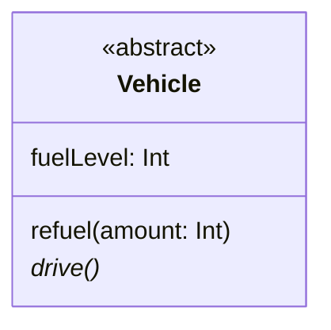
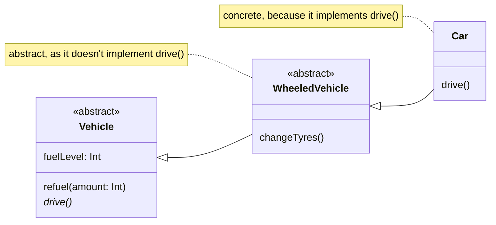

# Basic Concepts

## What is an Abstract Class?

So far, we have considered classes that are fully implemented, but it is
also possible to have classes that are only partially implemented. These are
known as **abstract classes**.

In an abstract class, one or more methods will be declared with names,
parameter lists and return types, but no method body will be provided for
them. These unimplemented methods are known as **abstract methods**. The
intention is that **subclasses will provide the missing implementations of
these abstract methods**.

Because an abstract class is incomplete, it is not possible to create an
instance of such a class in a program. Attempting to do so will result in a
compiler error. We are, however, allowed to create instances of **concrete
subclasses** of that abstract class. A concrete subclass is a subclass that
implements all of the abstract features of its superclass.

If you create a subclass of an abstract class but do not implement all of its
abstract methods, then that subclass will also be abstract.

## UML Representation

On UML class diagrams, abstract classes are often shown by rendering the
name of the class, and the name of any abstract features, in an italic font.

It is also common to see class names labelled with the **&laquo;abstract&raquo;**
stereotype[^uml].

@fig-abs-example shows an example of a class that has a mixture of abstract
and concrete features.

````{figure}
:label: fig-abs-example
:enumerator: 16.1.1


UML representation of an abstract class
````

The `Vehicle` class of @fig-abs-example exists partly to provide some state
and functionality to instances of its subclasses, via the `fuelLevel` property
and `refuel()` method. However, it also specifies an abstract method,
`drive()`.

A subclass of `Vehicle` that does not provide an implementation of the
`drive()` method will also need to be labelled as &laquo;abstract&raquo;.
For example, in @fig-abs-impact, the `WheeledVehicle` class is abstract but
the `Car` class is not.

````{figure}
:label: fig-abs-impact
:enumerator: 16.1.2


Example of how abstractness propagates down a class hierarchy
````


[^uml]: Strictly speaking, this usage doesn't conform fully to the rules
of UML, but it is commonly seen, easy to understand, and is the only way of
showing abstractness in some UML diagramming tools.
