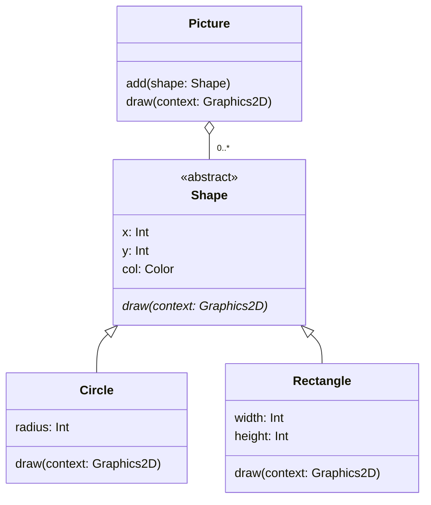

# Case Study Revisited

Let's see how abstract classes can improve the picture drawing application
that we developed in the [earlier case study][case].

[Version 2][v2] of the application has a `Shape` class that looks like this:

```kotlin
open class Shape(val x: Int, val y: Int, val col: Color) {
    open fun draw(context: Graphics2D) {
        // nothing to do here
    }
}
```

Just so you are clear on why this implementation is not ideal, return to the
`task15_4_2` directory of your repository, edit `Main.kt`, and add the
following new line to the code that configures the `Picture` object:

```kotlin
add(Shape(0, 0, Color.RED))
```

Rebuild and rerun the application with

    ./kotlin run

This should complete successfully, displaying exactly the same picture
as before.

This experiment demonstrates that adding actual `Shape` objects to a picture
is permitted, even though it is meaningless to do so!

Whilst this causes no real problems at run time, it would be nice if we could
prevent meaningless code like this from compiling in the first place.

The solution is to make the `Shape` class abstract (@fig-abs-shape).

````{figure}
:label: fig-abs-shape
:enumerator: 16.3

`Shape` as an abstract class
````

The implementation of `Shape` now looks like this:

```kotlin
abstract class Shape(val x: Int, val y: Int, val col: Color) {
    abstract fun draw(context: Graphics2D)
}
```

## Task 16.3

The directory `tasks/task16_3` is a KT project containing Version 3 of the
picture drawing application, in which `Shape` is now an abstract class.

If you examine `Shape.kt`, you'll see the implementation shown above.

Build and run the application with

    ./kotlin run

You should see a now-familiar picture appear.

Now edit `Main.kt` and add the following line to the code that configures the
`Picture` object:

```kotlin
add(Shape(0, 0, Color.RED))
```

This time, you should get a compiler error when you attempt to rebuild
the application.


[case]: ../inherit/case-study.md
[v2]: ../inherit/case-study.md#polymorphic-solution
