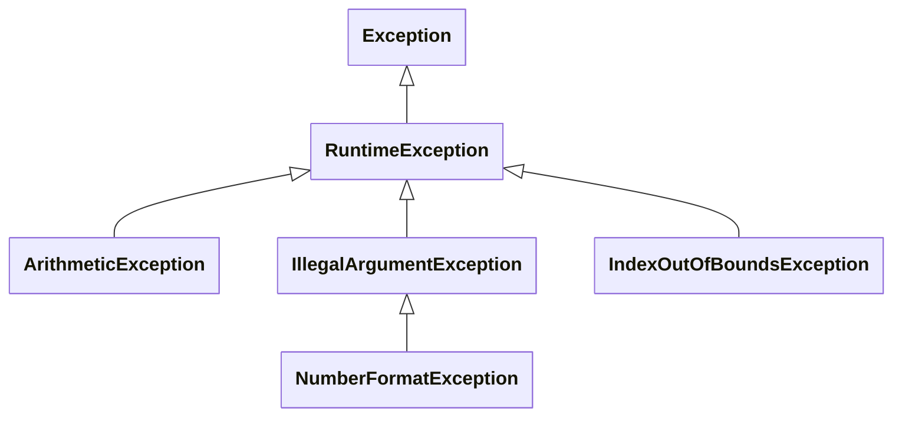

# Features of Exceptions

Exceptions have two key features that distinguish them from the approaches
considered in the previous section.

First, an exception is an object of a distinct type, used specifically to
signal errors[^cpp]. The type of the exception conveys information about the
nature of the error, and further details can be provided via data stored
inside the exception object.

Second, **an exception cannot be ignored**. When an exception occurs, it
fundamentally changes the flow of control within a program. If no code is
found to intercept and deal with an exception, it will halt the program.

## Information Provision

Exceptions are implemented as **classes**, with names that indicate the kind
of error that they represent. These classes are typically organized into a
hierarchy (@fig-except).

````{figure}
:label: fig-except
:enumerator: 9.2


Part of Kotlin's exception class hierarchy
````

Note that classes lower in the hierarchy represent more specialized types
of error.

Aside from providing information via the name of its class, an exception has
a `String` property named `message` that can be used to give further details
of the error. This property can be given a value when you create an exception
object.

For example, the `variance()` function discussed previously could signal an
insufficient amount of data using this exception object:

```kotlin
IllegalArgumentException("not enough data")
```

The class name tells us that the argument supplied to `variance()` is not
suitable, and the string provides details of why that is the case.

### Custom Exceptions

The standard exception types will often meet your needs, but sometimes it is
useful to define your own exception class, and Kotlin makes this very easy
to do:

```kotlin
class MyException(message: String) : Exception(message)
```

There are basically three reasons why you might want to do this:

* You want to convey more information about the error, via the name
  of the class
* You want to be able to easily intercept this specific type of error
* You want to add more information to the exception, beyond a basic
  error message

For example, consider the `writeToFile()` function seen in the previous
section. If writing to the file fails, you might want to indicate this via a
dedicated exception that includes the line number on which failure occurred.
You could define a suitable exception class like this:

```kotlin
class TextException(msg: String, val line: Int) : Exception(msg)
```

:::{note}
Don't worry about understanding the syntax here. We will discuss it properly
when we cover [classes][cls] and [subclasses][sub] later.
:::

## Task 9.2

Let's examine how an exception affects flow of control in a program.

1. Open the `tasks/task9_2` directory of your repository in your preferred
   code editing environment. Study the code in `Main.kt`, then compile
   and run the program.

1. Examine the program's output carefully. This shows you that `main()` calls
   the function `first()`, which in turn calls `second()`. This stack of
   function calls then 'unwinds': `second()` finishes normally, then
   `first()`, then `main()`.

1. A line of `second()` that causes an exception has been commented out.
   Uncomment it now, then recompile the program and run it again. How has the
   behaviour changed?

The key point to note from this demo is that **none of the messages about
leaving a function were printed** after you uncommented that line of code.
When the exception occurs inside `second()`, it prevents any of the other code
from running[^fin]. The only way to regain control over program execution
is to catch the exception.

When you don't intercept an exception in a program, you may see a
**stack trace**:

```{code} plaintext
:linenos:
:emphasize-lines: 3
Exception in thread "main" java.lang.ArrayIndexOutOfBoundsException: Index 5 out of bounds for length 5
  at java.base/java.util.Arrays$ArrayList.get(Arrays.java:4266)
  at MainKt.second(Main.kt:18)
  at MainKt.first(Main.kt:11)
  at MainKt.main(Main.kt:5)
  at MainKt.main(Main.kt)
```

This shows you the type of the exception and its associated error message,
followed by details of the call stack at the time of the exception.

:::{tip}
When you see a stack trace like this, work your way down from the top,
moving past any references to library code in which the exception may have
originated, until you reach the first reference to your own code. This will
give you a filename and a line number, showing you where you can begin your
investigation into what caused the error.

In this case, line 18 of `Main.kt`, inside the function `second()`, is
identified as the cause of the problem. (This, of course, is the line that
you uncommented!)
:::


[^cpp]: This is not true of all languages. In C++, for example, it is
possible to use values of almost any type as exceptions.

[^fin]: This is true for this specific example, but other code can run in
cases where `finally` has been used.

[cls]: ../classes/basics.md
[sub]: ../inherit/subclasses.md
