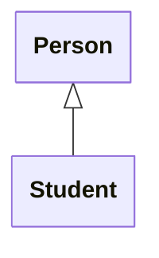

# Basic Concepts

<!-- TODO: Should this conceptual stuff be part of previous section? -->

Human beings understand the world by grouping things into particular
categories or classes, but these classes are not independent of each other;
instead, they are organized into a hierarchy.

An example of this is how we organize our knowledge about the animal kingdom.

```{figure} animals.png
:label: fig-hierarchy
:enumerator: 15.1.1
:alt: Diagram of rectangles, organized into a hierarchy and linked across levels with arrows
:width: 532px

Class hierarchy for the animal kingdom
```

In @fig-hierarchy, the most general class, `Animal`, is at the top, at the
root of an 'inverted tree'. As we move downwards, classes become more
specialized. Those at the bottom (the leaves of the tree) are the most
specialized of all.

Consider two specific classes from this diagram: `Bird` and `Owl`.

We say that `Bird` is the **superclass** of `Owl`, and that `Owl` is a
**subclass** of `Bird`[^base].

We can also say that `Owl` 'specializes' `Bird`. The relationship between
the two classes is one of **specialization**. In practice, this means that
`Owl` inherits things from `Bird`, so we can also describe the relationship
using the term **inheritance**. We will use that term here[^term].

This hierarchical organization of classes is very useful. For one thing, it
facilitates more efficient communication of information about a class.

Imagine, for instance, that you were familiar with the concept of birds in
general, but you didn't know what an owl was. Someone could painstakingly
describe to you an owl's feathers, the fact that it has wings and can fly,
etc; or they could just tell you "a bird is a kind of owl". That simple
phrase would instantly reveal the most important things to know about owls.

## Inheritance in Software Classes

A class hierarchy in the real world helps us to organize and communicate
information more efficiently, and we can glean analogous benefits from
organizing software classes into inheritance hierarchies.

In such a hierarchy, a subclass inherits the attributes and behaviour of
its superclass, so inheritance provides a structured mechanism for code
reuse. Instead of having code duplicated across multiple classes, that code
can be provided once only, in a superclass from which they all inherit.

Besides inheriting code from a superclass, a subclass can

* Add new attributes and behaviour that aren't found in the superclass

* Alter specific behaviour that was inherited from the superclass

## Choosing Inheritance

When should you make one class inherit from another?

This is actually quite easy to determine!

:::{tip}
If you have an existing class X and you want to know if a new class Y should
inherit from X, just ask yourself whether the phrase "Y is a kind of X"
makes sense.

**If "is a kind of" doesn't describe the relationship accurately, then
you should not be using inheritance!**
:::

Newcomers to the concept of inheritance sometimes see it primarily as a
mechanism for code reuse, and hence they are tempted to ignore the
requirement that "is a kind of" should describe the relationship between
the classes accurately.

But code reuse is really just a secondary benefit of inheritance. The
primary benefit comes from **substitutability**. A properly constructed
inheritance hierarchy will adhere to the [**Liskov substitution principle**][lsp]
(LSP), meaning that a subclass will always be substitutable for its direct
superclass, or any of its more distant ancestors further up the tree.

For example, suppose you have a superclass `Person`, along with subclasses
`StaffMember` and `Student`. This makes sense, because a member of staff is a
kind of person, as is a student.

Now suppose that you also have a function with a parameter of type `Person`.
LSP means that you are allowed to call that function with either a
`StaffMember` object or a `Student` object as an argument. The code should
compile and the function should behave sensibly in both cases.

We will explore the practical benefits of LSP in more detail [later in this
section][study].

## UML Syntax

On a UML class diagram, we show that one class is a subclass of another by
drawing a specific type of arrow between the classes. **The arrow must have
a solid line and an unfilled triangular arrowhead**, and it must point
**from the subclass to the superclass**.

````{figure}
:label: fig-uml-subclass
:enumerator: 15.1.2


UML syntax for relationship between class and subclass
````

:::{danger} Important
Be very careful when you draw relationship arrows on class diagrams!

The details really do matter. Using a v-shaped arrowhead instead of an
unfilled triangle, for example, would make the relationship in
@fig-uml-subclass an association, which is clearly incorrect.
:::

## Potential Drawbacks

Inheritance is a very helpful feature of object-oriented languages, but there
are a few potential disadvantages to using it.

For example, it can be hard to understand where the methods available in
a class come from, if that class is part of a deep inheritance hierarchy.
Some could come from the parent, others from the grandparent, etc. Deep
hierarchies are generally quite hard to work with.

Another issue is that a subclass and a superclass are very tightly coupled
to each other. Once you have classes inheriting from a superclass, it becomes
harder to change things in that superclass. You don't necessarily know, simply
by examining the code in the superclass, whether or not a change to that code
will cause a subclass to break in some way. This is sometimes described as
the **fragile base class problem**.


[^base]: The terms 'base class' and 'derived class' are less common
alternatives for superclass and subclass.

[^term]: Strictly speaking, inheritance is just the mechanism by which
specialization is implemented. We will be a bit looser in our use of
terminology here and use 'inheritance' to describe the relationship itself,
as well as its implementation.

[lsp]: https://en.wikipedia.org/wiki/Liskov_substitution_principle

[study]: case-study.md
