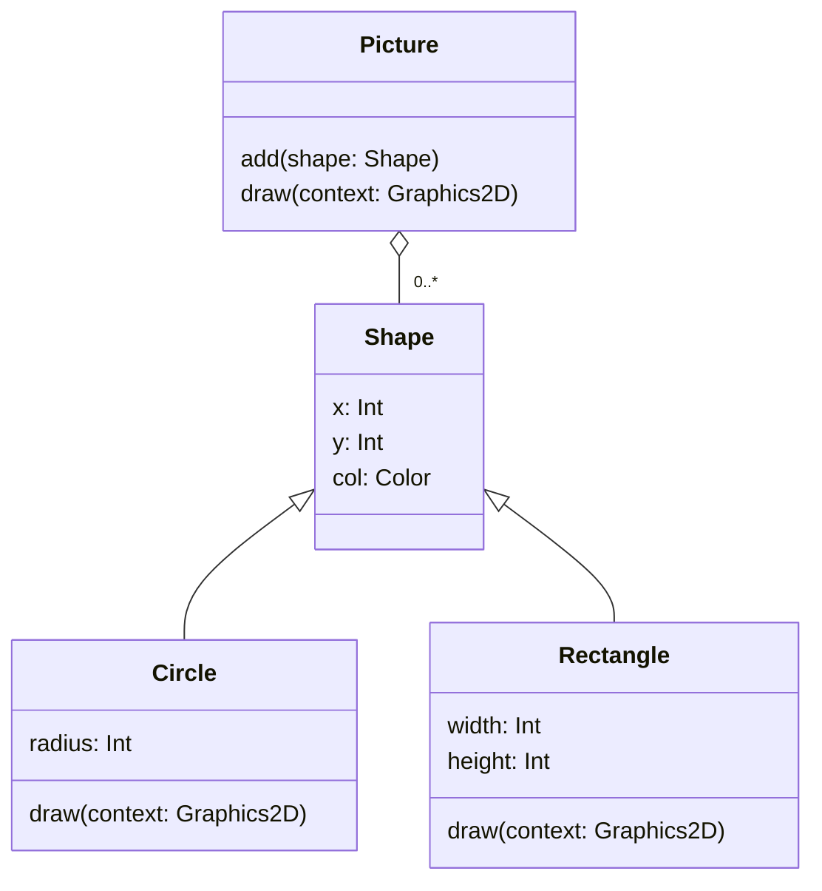

# Case Study

Imagine that you are tasked with creating a 2D graphics application.
A description of what this application must do includes the following text:

> The application must draw a picture. A picture is composed of 2D shapes
> such as circles, rectangles, etc, which can have different positions, sizes
> and colours.

Analysis of this text suggests `Picture`, `Shape`, `Circle` and `Rectangle`
as candidate classes, with position, size and colour as attributes and 'draw'
as the key operation, but that leaves us with several questions to answer:

* How do the classes relate to each other?
* Where do we put those attributes?
* How can the classes work together to support drawing of the picture?

## Initial Solution

One possible solution is to have `Circle` and `Rectangle` inheriting from
`Shape`. The `Shape` class can supply the two properties commmon to all kinds
of shape: position (specified via x and y coordinates) and colour.
Subclasses can then add further properties to specify the size of a shape in
an appropriate way (e.g., radius for `Circle`, width & height for `Rectangle`),
as well as a `draw()` method that handles the specifics of shape drawing.

A picture is essentially a collection of shapes, so the relationship between
`Picture` and `Shape` is one of aggregation or composition. The `Picture`
class can use a collection type such as a mutable list to implement this
relationship. If list contents are specified to be of type `Shape` then we
will be able to add instances of `Circle`, `Rectangle` or any other subclass
of `Shape` to the collection.

@fig-initial-uml shows the structure of this solution as a class diagram.

````{figure}
:label: fig-initial-uml
:enumerator: 15.4.1

Initial solution for the graphics application
````

We assume that this application is running on the JVM and using features
of the Java standard library to handle graphics. `Color` is a Java class for
representing colours, and `Graphics2D` represents a 'graphics context', into
which we can draw anything want.

:::{attention .simple icon=false} **Question**
The application will somehow create a `Picture` object and then invoke its
`draw()` method to draw the picture. This, in turn, will need to invoke the
`draw()` methods of all the shapes stored in its list. How should it do this?
:::

### Drawing Shapes

Here's a complete implementation of `Picture`, showing how `draw()` might
do its work:

```{code} kotlin
:linenos:
import java.awt.Graphics2D

class Picture {
    private val shapes = mutableListOf<Shape>()

    fun add(shape: Shape) = shapes.add(shape)

    fun draw(context: Graphics2D) = shapes.forEach { shape ->
        when {
            shape is Circle -> shape.draw(context)
            shape is Rectangle -> shape.draw(context)
        }
    }
}
```

Focus here on the body of the `draw()` method (lines 8&ndash;13). This
iterates over the list of shapes, taking each object and checking its type.
Kotlin's [smart casting][smc] feature ensures that, on a successful check for
a particular type, the object can subsequently be treated as an instance of
that type.

Thus, when we reach the code `shape.draw(context)` in the first branch of the
`when` expression, `shape` is known to be a `Circle` object, and the version
of `draw()` from `Circle` is invoked.

Similarly, when we reach the code `shape.draw(context)` in the second branch
of the `when` expression, `shape` is known to be a `Rectangle` object, and
the version of `draw()` from `Rectangle` is invoked.

:::{danger} Important
**This is not a good way of implementing the `Picture` class!**

Consider what happens if we want to draw triangles. We will need a `Triangle`
class, inheriting from `Shape`, **but we will also need to add a new branch
to the `when` expression in the `draw()` method**:

    shape is Triangle -> shape.draw(context)

We will need to do something similar each time that we add a new kind of
shape to the application.
:::

### Task 15.4.1

1. The `tasks/task15_4_1` directory of your repository is a KT project
   containing the complete code for our initial solution.

1. Examine the files in the `src` subdirectory of the project. Focus your
   attention on `Shape.kt`, `Circle.kt`, `Rectangle.kt` and `Picture.kt`.
   (You can examine the other files if you are interested, but this
   isn't necessary.)

1. Run the application with

       ./kotlin run

   You should see a window appear on screen, containing several circles and
   rectangles of different sizes and colours (@fig-initial-pic).

```{figure} picture-v1.png
:label: fig-initial-pic
:enumerator: 15.4.2
:alt: Screenshot of a window displaying a mixture of circles & rectangles, of different colours and sizes
:width: 300px

Picture generated by initial solution of the graphics case study
```

## Polymorphic Solution

The problem with the initial version of our graphics application is that
`draw()` is defined only in the subclasses `Circle` and `Rectangle`.
Consequently, we need to do type checking on every object reference retrieved
from the list of shapes, allowing Kotlin to 'smart cast' it into either a
`Circle` reference or a `Rectangle` reference, before attempting to invoke
`draw()`.

This makes the `draw()` method of `Picture` inflexible. Additional type
checking will be needed every time that we add support for a new kind of shape.

A fix for this issue is fairly simple. We start by defining a `draw()` method
in `Shape`, making it open for overriding:

```kotlin
open class Shape(val x: Int, val y: Int, val col: Color) {
    open fun draw(context: Graphics2D) {
        // nothing to do here
    }
}
```

The implementation of `draw()` in `Shape` is empty, because the information
on what to draw is contain in subclasses of `Shape`, rather than `Shape`
itself[^better].

The `draw()` methods in `Circle` and `Rectangle` now need to declare that
they are overriding the version inherited from `Shape`:

```kotlin
override fun draw(context: Graphics2D) {
    ...
}
```

The `draw()` method in `Picture` can then be simplified to

```kotlin
fun draw(context: Graphics2D) = shapes.forEach {
    it.draw(context)
}
```

This much simpler implementation will compile successfully because `Shape` has
a `draw()` method, but the version of `draw()` that is invoked at run time
will be **the one that is appropriate to the object actually being
referenced**. We have replaced explicit type checking with dynamic binding.

:::{danger} Important
This new version of the `draw()` method **will not need to be altered if we
add new types of shape to the application**.

We describe code like this as **polymorphic**, meaning that it will work
with many different types of object (any subclass of `Shape`), exhibiting
varying behaviour as a result, without ever needing to be aware of the
specific type of object that it is manipulating.
:::

### Task 15.4.2

1. The `tasks/task15_4_2` directory of your repository is a KT project
   containing the complete code for the polymorphic solution.

   Examine the files in the `src` subdirectory of the project. Focus your
   attention on `Shape.kt`, `Circle.kt`, `Rectangle.kt` and `Picture.kt`.
   Compare each of these these files with the versions from Task 15.4.1 and
   note any differences.

1. Run the application with

       ./kotlin run

   It should behave exactly as before.

1. Examine `Triangle.kt`. This is a new subclass of `Shape`, to represent
   triangles. Currently, it is not used in the application.

1. Edit `Main.kt` and uncomment the line that adds a `Triangle` object to the
   picture. Save the file, then rebuild and rerun the application. You should
   now see a small red triangle in the picture.

   **Notice that you didn't need to make any changes to the `Picture` class
   in order for this to happen.**


[^better]: We will improve on this solution [later](../abstract/case-study.md),
when we look at abstract classes.

[smc]: https://kotlinlang.org/docs/typecasts.html#smart-casts
