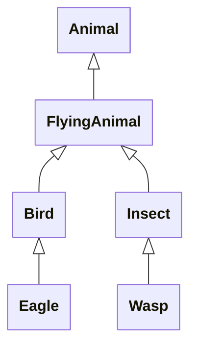
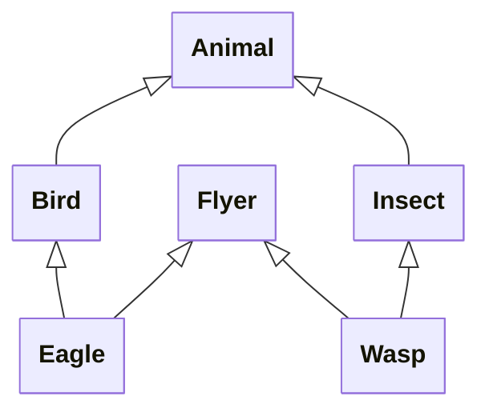
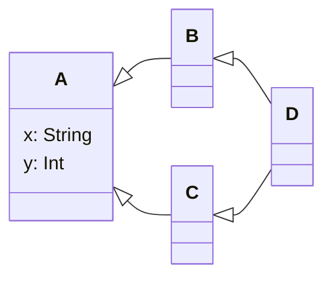

# Multiple Inheritance?

Imagine that you are creating a game that simulates the natural world in a
detailed way. The simulation includes various species of animal, some of
which can fly.

You might be tempted to represent the various different animal species of
this simulation in a class hierarchy like that shown in @fig-animals-si.

````{figure}
:label: fig-animals-si
:enumerator: 15.5.1

Attempt to model flying animals in an object-oriented way
````

The problem with this hierarchy is that it assumes that all birds and
insects fly, which is not the case. So how do we express the idea that an
eagle is a bird *and* that it can fly?

One solution might be to have a hierarchy like that shown in @fig-animals-mi.

````{figure}
:label: fig-animals-mi
:enumerator: 15.5.2

Modelling flying animals with multiple inheritance
````

Here, `Eagle` is a kind of `Bird` *and* a kind of `Flyer`; in other words, it
has *two* superclasses. This is termed **multiple inheritance**.

Multiple inheritance is allowed in some object-oriented languages, but not
in others. For example, it is possible in C++ and Python, but not in C# or
Java, **and not in Kotlin**.

To understand why, consider the classic 'inheritance diamond' scenario of
@fig-diamond.

````{figure}
:label: fig-diamond
:enumerator: 15.5.3

A problem with multiple inheritance
````

Here, class `A` has properties `x` and `y`. Class `B` inherits from `A`,
thereby inheriting both of those properties. Class `C` does the same.

So what happens when we have a class `D`, inheriting from both `B` and `C`?
Does `D` get two properties named `x` and two named `y`? If so, which of
them will be used we attempt to access `x` or `y` in an instance of `D`?
And if `D` inherits only a single `x` property and a single `y` property,
from which superclass does it inherit them?

By not supporting multiple inheritance, C#, Java and Kotlin avoid having to
deal with problems like this. Yet these languages are still able to exploit
some of the benefits of multiple inheritance, through the use of
[interfaces][int].


[int]: ../interfaces/index.md
