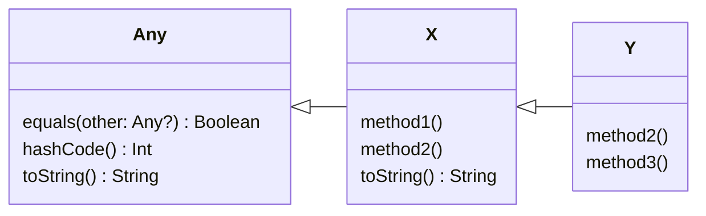

# Overriding & Dynamic Binding

## Overriding Methods

A method inherited from an open superclass can be **overridden** (i.e.,
replaced) in a subclass. For this to happen, you need to

* Declare the method in the superclass as `open` for overriding
* Use the `override` keyword when defining the method in the subclass

### Task 15.3

Open the `tasks/task15_3` directory of your repository. Edit the files
`Person.kt` and `Student.kt`. Add to these files the following class
definitions:

```{code} kotlin
:filename: Person.kt
open class Person {
   fun speak() {
       println("I am a Person")
   }
}
```

```{code} kotlin
:filename: Student.kt
class Student(val degree: String) : Person() {
}
```

Try compiling the code, using

    ./kotlin build

This should succeed without any problems.

Now add the following method definition to `Student`:

```kotlin
fun speak() {
   println("I am a Student, studying $degree")
}
```

Try recompiling the code. What error do you see?

Edit `Student.kt` and apply the `override` modifier, following the advice of
the error message. Try recompiling the code. What error do you see now?

Fix the error by applying the `open` modifier to the definition of `speak()` in
the `Person` class. You should find that the code now compiles successfully.

## Overriding Properties

It is also possible to override properties inherited from a superclass. As
with methods, the property in the superclass must be declared as `open` for
overriding, and the redefinition of the property in the subclass must be made
using the `override` modifier.

```kotlin
open class Shape {
    open val isPolygon = false
}

class Triangle : Shape() {
    override val isPolygon = true
}
```

:::{caution}
Note that when you override a property, **the redefinition of the property
in the subclass must be of the same type, or a subtype**. So you are not
allowed to override a `Boolean` property with an `Int`, for example.

Also, you can override a `val` property with a `var`, but **you cannot override
a `var` property with a `val`**. This is because a `var` property has both a
getter and a setter, whereas a `val` has only a getter. If we allowed a `var`
to be overridden by a `val`, this would effectively remove functionality in
the subclass, violating the LSP.
:::

## What Happens Here?

Let's return to Task 15.3. You should currently have these classes:

```{code} kotlin
:filename: Person.kt
open class Person {
    open fun speak() {
        println("I am a Person")
    }
}
```

```{code} kotlin
:filename: Student.kt
class Student(val degree: String) : Person() {
    override fun speak() {
        println("I am a Student, studying $degree")
    }
}
```

Add the following program to the project **but do not run it yet**:

```{code} kotlin
:filename: Main.kt
fun main() {
    val p = Person()
    p.speak()

    val s = Student("Computer Science")
    s.speak()

    val p2: Person = Student("Maths")
    p2.speak()
}
```

This program contains three examples of creating an object and invoking its
`speak()` method. But what do we see printed on the console in each case?

Try to predict the output, then run the program to see if you are right.

:::{note .dropdown} Discussion
The first line of output is unambiguous. We have created a `Person` object.
Type inference means that the type of `p` is `Person`. So the output is
determined by the `speak()` method in the `Person` class.

The second line of output is also unambiguous. We have created a `Student`
object. Type inference means that the type of `s` is `Student`. So the output
is determined by the `speak()` method in the `Student` class.

It's less obvious what the third line of output should be. The object that
we've created is a `Student`, but the type of variable `p2` is `Person`.
However, what matters is the **type of the object being referenced**, not
the type of the reference itself. Hence the `speak()` method of `Student`
is invoked here.
:::

## Dynamic Binding

When an open method from a superclass is overridden in subclasses, this allows
**dynamic binding** (or 'run-time binding') of method calls to take place.
In dynamic binding, a determination of which method to call is made at run
time.

The counterpart to dynamic binding is **static binding** (or 'compile-time
binding'). In static binding, a determination of which method to call can be
made at compile time.

Methods are open for overriding by default in Java, so dynamic binding is
always possible, unless we prevent overriding by marking a method as `final`.
In Kotlin, it is the other way around; dynamic binding cannot happen unless
we mark a method as open and then override it in subclasses. C++ is a bit
like Kotlin in this regard, in that static binding is the default and special
steps are needed to enable dynamic binding.

Object-oriented languages often implement dynamic binding by providing a
**method dispatch table** (also known as a 'vtable') for each class.

### Example

Consider the following Kotlin classes:

```kotlin
open class X {
    fun method1() {}
    open fun method2() {}
    override fun toString() = "hello"
}

class Y : X() {
    override fun method2() {}
    fun method3() {}
}
```

Kotlin classes that don't declare an explicit superclass will inherit
implicitly from the special class `Any`. Hence the full class hierarchy is
that shown in @fig-dispatch-example.

````{figure}
:label: fig-dispatch-example
:enumerator: 15.3

Class hierarchy for method dispatch example
````

The key point here is that `X` inherits methods from `Any`, which it can
override if it wishes. `Y` will inherit these methods too, plus the
non-private methods of `X`.

A method dispatch table for the class `Y` could therefore look something
like this[^imp]:

| Method name | Code invoked       |
|-------------|--------------------|
| `equals`    | `Any.equals()`     |
| `hashCode`  | `Any.hashCode()`   |
| `method1`   | `X.method1()`      |
| `method2`   | `Y.method2()`      |
| `method3`   | `Y.method3()`      |
| `toString`  | `X.toString()`     |

Now imagine we have a variable `thing`, defined like this:

```kotlin
val thing: X = Y()
```

To resolve the method call `thing.method2()`, we look at the object referenced
by `thing`, see that it is of type `Y`, then look for `method2` in the
dispatch table of `Y`. The dispatch table tells us that the version of
`method2` defined in class `Y` is the one that we need to call.

Now imagine that the method call is `thing.toString()`. Resolving this via the
same process will lead to invocation of the version of `toString()` defined
in `X`. Similarly, `thing.hashCode()` will resolve to the version of
`hashCode()` defined in `Any`.


[^imp]: Note that this isn't intended as an explanation of how dynamic binding
actually works in Kotlin! We are simply using these classes as examples to
illustrate the principle of using a method dispatch table.
