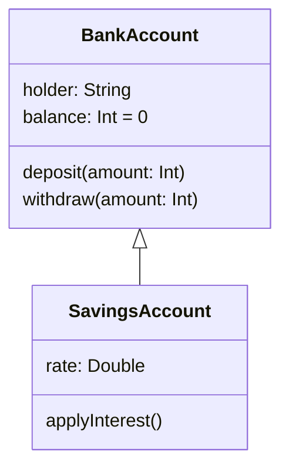

# Subclasses in Kotlin

## Basic Syntax

Let's start with a very simple example of a superclass and subclass, stripping
everything away from both classes so we can focus on the basic syntax:

```kotlin
open class Parent

class Child : Parent()
```

Here, `Parent` is the superclass and `Child` is the subclass.

Note the use of `open` in front of the definition of `Parent`. Kotlin classes
are **closed for inheritance by default**, meaning that a class cannot act
as the superclass of another unless we allow this explicitly, using the
`open` modifier[^open].

Note also how the definition of `Child` includes a colon, followed by
`Parent()`. This not only names `Parent` as the superclass, it also declares
that the default constructor of `Parent` will be invoked as part of the
process of creating a `Child` object.

:::{note}
**Subclasses always need to specify how they want to initialize any properties
that have been inherited from the superclass.** They do this by indicating
which superclass constructor should be invoked.
:::

### Task 15.2.1

Open the `tasks/task15_2_1` directory of your repository. Edit `Classes.kt`
and add the two class definitions for `Parent` and `Child` shown above.

Check that the code compiles, using

    ./kotlin build

Next, add another class definition to `Classes.kt`:

```kotlin
class GrandChild : Child()
```

Try to recompile. Note the error message from the compiler.

Finally, add the `open` modifier to the definition of `Child`, then attempt
to recompile. This time compilation should succeed.

This shows you that openness doesn't 'carry forward' from superclass to
subclass. The `open` modifier will need to be used repeatedly when building
an inheritance hierarchy.

## Another Example

Consider a class to represent a person. For simplicity, let's assume that it
has only one property, the person's name. We can specify this class, enable
inheritance and give it a primary constructor with a single line of code:

```kotlin
open class Person(val name: String)
```

Now suppose that we need a class to represent a student. A student has a name
and also a degree programme on which they are enrolled. A student is a kind of
person, so our `Student` class should be a subclass of `Person`, inheriting
its `name` property and then adding another property to represent degree
programme.

We can define `Student` like this:

```kotlin
class Student(name: String, val degree: String) : Person(name)
             ----------------------------------
```

Look closely at the parameter list of `Student`'s primary constructor
(underlined for emphasis).

Notice that `degree` is prefixed with `val`, indicating that this is a
property defined within `Student`, as well as being a parameter of the primary
constructor of `Student`.

By contrast, `name` is just a regular constructor parameter. It isn't defined
as a property in `Student` **because we are already inheriting a `name`
property from `Person`**.

When creating a `Student` object, a student's name and degree programme must
both be supplied as strings. The degree programme will be used by the primary
constructor of `Student` but the name will be forwarded directly to the primary
constructor of the superclass:

```kotlin
class Student(name: String, val degree: String) : Person(name)
                                                  ------------
```

Here's an example of how we might create and use a `Student` object:

```kotlin
val student = Student("Sarah", "Computer Science")

println(student.name)     // accesses inherited property
println(student.degree)
```

### Task 15.2.2

Open the `tasks/task15_2_2` directory of your repository. Examine the files
`Person.kt` and `Student.kt`. These contain the code described above, with
some additions to show which constructors are being invoked when a `Student`
object is created.

This directory also contains a program, in `Main.kt`. Run it now, with

    ./kotlin run

Study the output. Notice how the superclass constructor is invoked first.

## Task 15.2.3

@fig-accounts shows classes `BankAccount` and `SavingsAccount`.

`BankAccount` represents an account held by a customer of a bank. This class
has a `String` property identifying the account holder, and an `Int` property
to represent the current balance of the account. The class also has methods
to handle the deposit and withdrawal of money.

`SavingsAccount` represents a bank account that can accrue interest on its
balance, at a specified interest rate. This class has a method that calculates
the amount of interest and applies it to the account balance.

````{figure}
:label: fig-accounts
:enumerator: 15.2

Classes representing different types of bank account
````

Open the `tasks/task15_2_3` directory of your repository. This is a KT
project containing a partial implementation of @fig-accounts.

Examine `BankAccount.kt`. Notice that `balance` is a `var` but that it has
been given a custom setter that is private. This means that only code within
`BankAccount` has permission to assign to `balance` directly. The methods
`deposit()` and `withdraw()` constitute the public API for altering the
balance on an account.

Implement `SavingsAccount` in `SavingsAccount.kt`, guided by @fig-accounts.
Note that

- `rate` should be a `val`, initialized by the primary constructor of
  the class.

- Creating a `SavingsAccount` should fail if interest rate is not > 0.

- `applyInterest()` should treat `rate` as as a percentage and use it to
  compute the accrued interest. It should then deposit the computed amount
  in the account.

Check that both classes compile, using

    ./kotlin build

Edit `Main.kt` and modify `main()` so that it

* Creates a savings account with an interest rate of 1.8%
* Deposits £1,250 in the account
* Accrues interest for five years, by invoking `applyInterest()` five times
* Withdraws £50 from the account
* Displays the final balance of the account

Run your program with

    ./kotlin run

Check that it behaves as expected.

## Visibility in Subclasses

We saw [earlier][vis] that it is possible to make members of a class private,
hiding them from class users. These private members become part of the
class implementation, rather than its public API.

Inheriting from a class with private members **does not grant a subclass any
special privileges**. Thus code in a subclass will NOT have access to private
members of its superclass.

However, there is an intermediate level of visibility, **protected**, which
sits between private and public. Protected members are visible to the class
that contains them **and to subclasses**, but are otherwise inaccessible.

Members of a class can be given protected visibility using the `protected`
modifier. For example, we could take the `Dataset` class that we
[looked at earlier][data], open it for inheritance and give the list of
values protected visibility like so:

```kotlin
open class Dataset {
    protected val values = mutableListOf<Double>()
    ...
}
```

Whilst the methods and overloaded operators of `Dataset` are probably
sufficient for subclasses to do their work, there might be situations in
which those subclasses would benefit from the direct access to `values`
that protected visibility gives them.

````{exercise}
:label: ex-member-vis
:enumerator: 15.2
Which lines of the following code cause compiler errors?

```{code} kotlin
:linenos:
open class Parent {
    private fun method1() {}

    protected fun method2() {}

    fun method3() {
        method1()
        method2()
    }
}


class Child : Parent() {
    fun method4() {
        method1()
        method2()
    }
}

fun main() {
    val c = Child()
    c.method1()
    c.method2()
    c.method3()
    c.method4()
}
```
````

<!-- TODO: Also discuss sealed class hierarchies? -->

## Every Class is a Subclass!

We've focused in this subsection on how to create classes that inherit
explicitly from other classes, but it is important to note that **all classes
inherit implicitly from a special class named `Any`**. This special class
provides every Kotlin class with default implementations of several methods,
including `equals()` and `toString()`.

The `equals()` method is called whenever you test whether an object is equal
to another using the `==` operator. The `toString()` method is called
automatically whenever you try to print an instance of one of your classes
using the standard `print()`and `println()` functions.

As an example of how `Any` is used in Kotlin, consider how `println()` is
defined. One of the overloaded implementations of this function has this
signature:

```kotlin
fun println(message: Any?)
```

The `message` parameter has the type `Any?`, meaning that we can pass to
`println()` the value `null` or an instance of *any* class. In the latter
case, the `toString()` method of that class will be used to create the string
that is then printed on the console.


[^open]: This makes Kotlin a bit different from most other object-oriented
languages. Classes are open for inheritance by default in Java, C++ and
Python. You can prevent inheritance from a class in Java by declaring it
to be `final`. The same approach works in C++, for C++11 onwards.

[vis]: ../classes/vis.md
[data]: ../classes/vis.md#fixing-things
