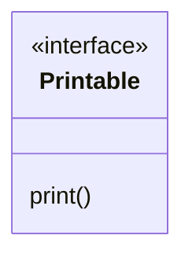
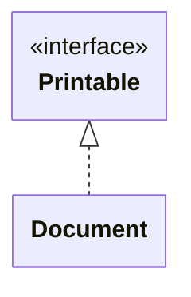
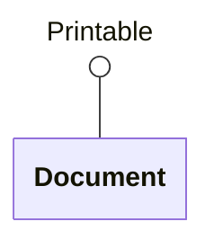

# Basic Concepts

## What is an Interface?

An interface is very similar to an abstract class. Like an abstract class,
it defines abstract methods, for the same reasons that an abstract class does.
Also, classes that use, or 'implement', an interface must provide
implementations of those abstract methods, just as concrete classes that
inherit from an abstract class must do.

However, interfaces offer more flexibility than abstract classes. A Kotlin,
Java or C# class can have only one class as its superclass, but **it can
implement many interfaces**.

This is possible because interfaces themselves are subject to certain
restrictions. We can't put anything we like into an interface. We will
consider these restrictions further when we look at the [Kotlin syntax for
creating interfaces][cri].

Thanks to these restrictions, we can use interfaces to achieve some of the
benefits of [multiple inheritance][mult], without having to deal with any
of its messy complications.

## Inheritance vs Interface Implementation

Having interfaces as a distinct entity in their own right makes sense, because
inheriting from a superclass and implementing an interface represent two
subtly different kinds of relationship, one weaker in nature than the other.

For many classes, there is one obvious 'parent' class, to which there is a
strong 'is a kind of' relationship. We can inherit both state and behaviour
from that superclass.

At the same time, there may also be lots of small ways in which the behaviour
specified by a class resembles that specified by other classes, from entirely
different branches of the inheritance hierarchy. Interfaces allow us to
capture and express these smaller, more limited resemblances.

The relationships between a class and the interfaces it implements are weaker
than the relationship between that class and its superclass, but they are
nonetheless important and useful&mdash;e.g., in supporting polymorphism.

## UML Representation

An interface is represented on a UML class diagram in a similar way to a
regular class, except that its name is prefixed with the
**&laquo;interface&raquo;** stereotype. For example, @fig-ifc-example shows
an interface `Printable`, containing a single abstract method.

````{figure}
:label: fig-ifc-example
:enumerator: 17.1.1


UML notation for an interface
````

Implementation of an interface by a class can be shown shown in a similar way
to specialization of a class, except that the arrow uses a **dashed line**.
For example, @fig-ifc-impl shows that a class `Document` implements the
`Printable` interface.

````{figure}
:label: fig-ifc-impl
:enumerator: 17.1.2


UML notation for interface implementation
````

Using a dashed line rather than a solid line is a visual indicator that
implementing an interface is a weaker kind of relationship than specializing
a class.

A more compact alternative is to use UML's 'lollipop' notation, as in
@fig-ifc-lollipop.

````{figure}
:label: fig-ifc-lollipop
:enumerator: 17.1.3


Lollipop notation for interface implementation
````

````{exercise}
:label: ex-ifc-error
:enumerator: 17.1
What is wrong with this UML class diagram?

```{image} uml-error.png
:alt: Button class, connected to Clickable interface by a dashed line with a v-shaped arrowhead
:width: 150px
```

1. The line should be solid, not dashed
2. The arrow should be pointing in the opposite direction
3. The arrowhead should be an unfilled triangle
4. There should be diamond on the other end of the dashed line
````


[cri]: creating.md
[mult]: ../inherit/multi.md
