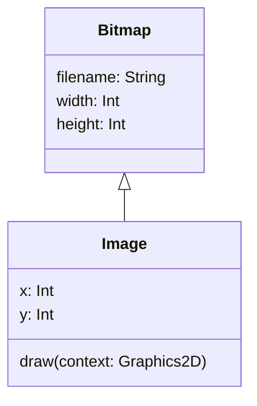
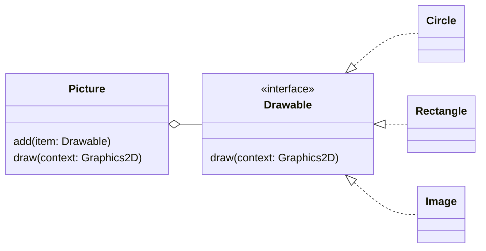

# Case Study Revisited

Let's revisit the graphics application case study one final time, for a
practical illustration of how interfaces can be useful.

Currently, [Version 3][v3] of the application has the ability to draw any kind
of shape, provided that it is implemented as a class that inherits from an
abstract superclass named `Shape` (see @fig-abs-shape).

Now imagine that we want to incorporate images into the pictures created by
the application. To help us achieve this, we will use an existing image
handling library that provides a class named `Bitmap`. This class can handle
loading bitmapped images from a file in any of the standard formats (PNG,
JPG, etc).

We can create an `Image` subclass of `Bitmap` easily enough, giving it
properties to represent the position of the image and a `draw()` method, just
like the `Shape` subclasses (@fig-uml-image).

````{figure}
:label: fig-uml-image
:enumerator: 17.5.1

`Image` class that inherits from `Bitmap`
````

But now we have a problem.

The current version of the `Picture` class can draw pictures composed of
objects whose classes inherit from `Shape`. The `Image` class does not inherit
from `Shape`, **and cannot be made to do so**, because it already has a
superclass, and **Kotlin does not support multiple inheritance**.

:::{note}
Even if Kotlin did support multiple inheritance, **it wouldn't make any sense
for `Image` to inherit from `Shape`**.

An image is not 'a kind of shape'; it is a different kind of thing entirely.

Inheritance makes sense only in situations where there is a clear 'is a
kind of' relationship between two classes.
:::

## Solution

An interface is the ideal solution to this problem.

Interfaces allow us to express the limited ways in which otherwise dissimilar
objects resemble each other. In this case, we have classes like `Circle` and
`Rectangle`, which are dissimilar from `Image`. The only behaviour that all
three of these classes have in common is the ability to be drawn into a
graphics context.

We can express this shared capability like so:

```kotlin
interface Drawable {
    fun draw(context: Graphics2D)
}
```

After introducing this interface into the application, we make `Circle`,
`Rectangle` and `Image` implement the interface, in addition to inheriting
from their respective superclasses. For example, `Circle` and `Image` will
now look like this:

```{code} kotlin
:filename: Circle.kt
:linenos:
:emphasize-lines: 2
class Circle(x: Int, y: Int, val radius: Int, color: Color) :
  Shape(x, y, color), Drawable {
    override fun draw(context: Graphics2D) {
        ...
    }
}
```

```{code} kotlin
:filename: Image.kt
:linenos:
:emphasize-lines: 2
class Image(val x: Int, val y: Int, filename: String) :
  Bitmap(filename), Drawable {
    override fun draw(context: Graphics2D) {
        ...
    }
}
```

You can see in the highlighted lines that these classes have different
superclasses, but they implement the same interface.

We then modify `Picture` so that it represents an aggregation of `Drawable`
objects:

```{code} kotlin
:filename: Picture.kt
:linenos:
class Picture {
    private val items = mutableListOf<Drawable>()

    fun add(item: Drawable) = items.add(item)

    fun draw(context: Graphics2D) = items.forEach {
        it.draw(context)
    }
}
```

````{figure}
:label: fig-final-uml
:enumerator: 17.5.2


Final solution for the graphics application
````

@fig-final-uml captures the essential details of this final, interface-based
implementation as a UML diagram. The 'English translation' of this diagram
reads as follows:

> A Picture is a collection of things that are Drawable.
> 
> Examples of Drawable things are Circle, Rectangle and Image.
> 
> We can add Drawable things one at a time to a Picture.
> 
> We can also draw a Picture, which is achieved by drawing each of the
> individual Drawable things that it contains.

Note that this diagram doesn't show any superclasses. They are not needed
here, as they are no longer relevant to how a picture is drawn.

## Task 17.5

The `tasks/task17_5` directory of your repository is a KT project containing
the final, interface-based version of the graphics application. Take some time
to examine the code in the `app/src` subdirectory, comparing it with earlier
versions.

Next, look at the code in `Shape.kt`. Notice that the `Shape` class no longer
specifies an abstract `draw()` method. This specification now resides in
the `Drawable` interface.

Although `Shape` no longer needs to be abstract, it makes sense for it to
remain so, to prevent creation of `Shape` objects.

Now look at the code in `Main.kt`. You can see here that the program creates
a picture containing a mixture of `Circle`, `Rectangle` and `Image` objects.

Finally, build and run the application with

    ./kotlin run

You should see a window appear on screen, containing shapes and images.

```{figure} picture-v4.png
:label: fig-final-pic
:enumerator: 17.5.3
:alt: Screenshot of a window displaying a mixture of circles, rectangles and images
:width: 300px

Picture generated by final solution of the graphics case study
```


[v3]: ../abstract/case-study.md

<!--
TODO: Add example to show Picture implementing Drawable?

This would be an example of the Composite design pattern. Could include
discussion as a subsection of this page or as part of a separate section on
design patterns...
-->
