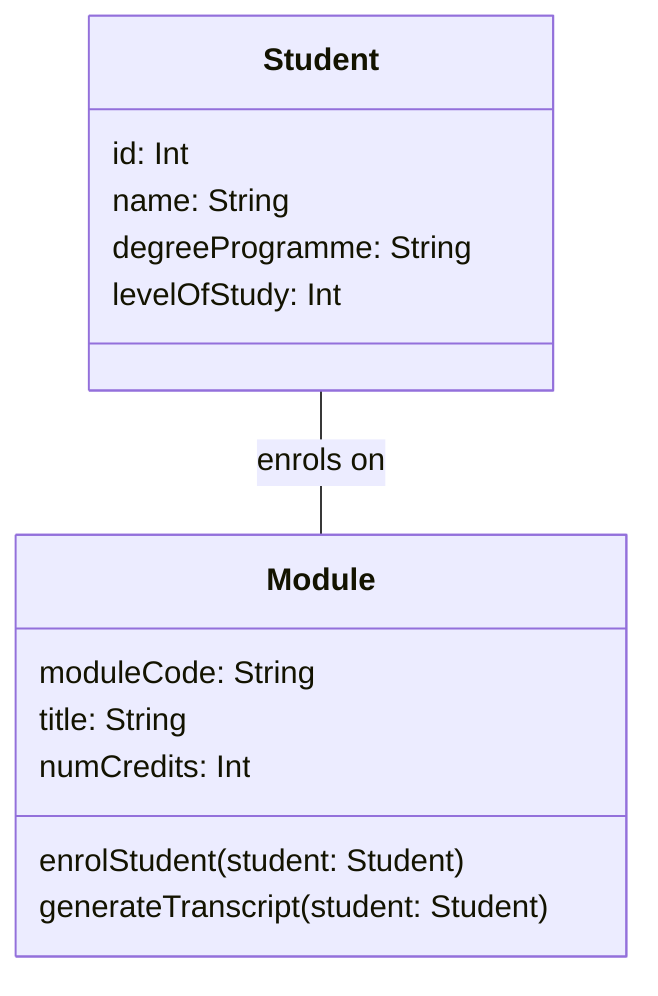

# Diagramming Tools

## Simple Tools

Agile software development approaches advocate use of the simplest tools
possible that allow a team to meet its goals. Rather than reaching immediately
for a software application to draw your diagrams, consider whether simpler
tools might be easier and more inclusive.

When your team is able to gather in one place, tools such as whiteboards,
flipcharts, Post-it notes and index cards can be very effective at facilitating
collaborative design and diagramming activities. There is no learning curve
to negotiate when using them, and diagrams can be redrawn quickly and easily
as the team explores different design ideas.

```{figure} hand-drawn.jpg
:label: fig-hand-drawn
:enumerator: 11.4.1
:alt: A roughly-sketched UML class diagram showing Enrolment, Seminar, Student & Professor classes
:width: 520px
:align: center

Hand-drawn class diagram from *Agile Modeling*, by Scott Ambler
```

When you've agreed on a diagram, it isn't necessary to redraw it 'nicely'
using a software application. If it is neat enough and legible enough, you can
simply capture a photo of it with your phone and upload that photo to wherever
your team stores its shared documentation.

This is an example of the 'just barely good enough' concept. Expending effort
on diagramming adds value up to a certain point; beyond that point, the value
of additional effort diminishes. That extra effort would be more usefully
spent on analysis of other use cases, or the actual implementation of classes.

```{figure} jbge.png
:label: fig-jbge
:enumerator: 11.4.2
:alt: A graph of Value vs Effort, showing an inverted parabola. The maximum is labelled "Just Barely Good Enough"
:width: 520px
:align: center

Illustration of 'Just Barely Good Enough'
```

## `draw.io`

Although simple physical tools can be the best option for collaborative
development, sometimes it is useful to produce something more polished, using
a software tool.

[`draw.io`][draw] is a powerful, free-to-use diagramming tool that [runs in
your browser][drapp]. You can also [run it as a desktop application][desk]
or as a [VS Code extension][vsc].

This tool is not limited to UML modelling activities. It can create
[many different types of diagram][many], including ER diagrams, network
infrastructure diagrams, and user interface mock-ups. You may find some of
these useful in the Semester 2 project.

Diagrams can be saved locally to your PC or to cloud storage (Google Drive,
OneDrive, GitHub). Saved diagrams are text files, in an XML format.

### Task 11.4.1

Watch the quick-start tutorial:

:::{iframe} https://www.youtube.com/embed/Z0D96ZikMkc?si=R6PtCnm4f1Sp9S9E
:width: 560px
:::

&nbsp;

Run the [`draw.io` browser application][drapp] and click the *Create New Diagram*
button. Specify `student.drawio` as the filename. Leave the diagram template
set to 'Blank Diagram', and click the *Create* button. When prompted for a
save location for the filename, choose the `task11_4_1` directory of your
repository.

Now click on the 'UML' menu item in the panel on the left of the application
window, to open up the list of available UML diagram elements.

**Note:** If you don't see a 'UML' menu item, click on the *More Shapes*
button at the bottom of the panel, and tick the 'UML' checkbox (NOT the
checkbox for 'UML 2.5').

Drag the diagram element labelled 'Class' from the list of diagram elements
into the canvas in the centre of the application window. Double-click on the
top compartment of the class and change its name to `Student`.

Double-click on the middle compartment. Edit the class attributes to match
those of the `Student` class shown on the design-level class diagram
[in the previous section][prev].

**Note:** you'll need to resize the attributes compartment so that all of the
attributes are visible.

Follow the same process to recreate the `Module` class from the design-level
class diagram. Be sure to include operations here, as well as attributes.

Link the two classes with an association. To do this, hover the cursor near
to an edge of the `Student` class. When you see a blue arrow, click and draw
the connection to the `Module` class.

Once the two classes are connected, select the association and remove the
navigability arrowhead (use the settings in the panel on the right of
the application window to do this).
   
Then double-click on the middle of the line and enter "enrols on" as the
label for the association. After providing the label, drag it to just above
or just below the line.

Finally, use 'Export As...' on the 'File' menu to export the diagram as a
PNG image. On the pop-up dialog of options, choose a Zoom Factor of 150% or
200%, for a larger, higher-quality image. Specify a Border Width of 5.
Then click on the *Export* button.

Specify `student.png` as the filename when prompted, and make sure that the
image is saved into the `task11_4_1` directory of your repository. Then
examine the exported image.

## Mermaid

[**Mermaid**][mer] is a JavaScript library that transforms a text-based
specification of a diagram into a graphical representation that is displayed
in a web browser.

Like draw.io, it can draw many different types of diagram, not just UML
diagrams.

The UML class diagram of @fig-mermaid-class can be specified like this in
Mermaid:

```
classDiagram
  Student -- Module : enrols on
  class Module {
    moduleCode: String
    title: String
    numCredits: Int
    enrolStudent(student: Student)
    generateTranscript(student: Student)
  }
  class Student {
    id: Int
    name: String
    degreeProgramme: String
    levelOfStudy: Int
  }
```

````{figure}
:label: fig-mermaid-class
:enumerator: 11.4.3


A UML class diagram generated using Mermaid
````

Mermaid works particularly well as a way of embedding diagrams into
Markdown documents[^embed]. GitHub supports Mermaid, so if you put Markdown
files containing Mermaid diagrams in your repository, those diagrams will be
rendered when you view the files on github.com in your browser.

This also applies to documents put into a GitHub wiki. This may come in handy
in Semester 2, when you are preparing the software design documents for your
group projects!

You can create Mermaid diagrams in a more interactive way using the
[Mermaid Live Editor][mrlive] or the full [Mermaid Chart app][mrapp]. You
can then copy the code from these tools and paste it into the document
where you want the diagram to appear; alternatively, you can export your
diagram from these tools as a PNG image or SVG document.

:::{note}
For a deep dive into the use of Mermaid in software development, see the
book [*Creating Software With Modern Diagramming Techniques*][mrbook],
by Ashley Peacock.
:::

### Task 11.4.2

Study Mermaid's [class diagram documentation][mrcls]. Focus on the first few
sections (Syntax, Define a Class, Defining Members, Defining Relationships).

Use the [Mermaid Live Editor][mrlive] to create a class diagram that has the
following features:

* A class `Customer`, with
  - Attributes `name` and `address`
  - A single operation named `placeOrder`
* A class `Order`, with
  - Attributes `orderNumber`, `datePlaced` and `deliveryDate`
  - Operations `checkStock` and `takePayment`
* A class `OrderItem`, with attributes `name` and `description`
* An association between `Customer` and `Order`, labeled "places"
* An association between `Order` and `OrderItem`, labelled "includes"

Do not put any details of attribute types or operation parameters on
your diagram.

Now edit the file `mermaid.md`, in the `task11_4_2` directory of your
repository. Note the lines that need to be replaced, as indicated by the
comment line beginning with `%%`.

Copy the Mermaid diagram specification from the live editor and paste it
into `mermaid.md`, replacing the indicated lines.

Commit your changes to `mermaid.md` and push them to GitHub. Then go to
your repository's home page on github.com and view the file. You should see
the diagram and the other content of the document properly rendered.


[^embed]: This is how we have used it in these teaching materials. The source
files for the web pages that you've been reading are all Markdown documents.
Most of the UML diagrams that you've seen on these pages are generated from
Mermaid specifications embedded in those documents.

[draw]: https://drawio.com
[drapp]: https://app.diagrams.net/
[desk]: https://get.diagrams.net/
[vsc]: https://marketplace.visualstudio.com/items?itemName=hediet.vscode-drawio
[many]: https://www.drawio.com/example-diagrams
[prev]: uml.md#design-level-diagrams
[mer]: https://mermaid.js.org/
[mrlive]: https://mermaid.live/
[mrapp]: https://mermaidchart.com/
[mrbook]: https://pragprog.com/titles/apdiag/creating-software-with-modern-diagramming-techniques/
[mrcls]: https://mermaid.js.org/syntax/classDiagram.html
