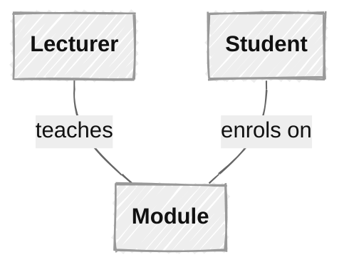
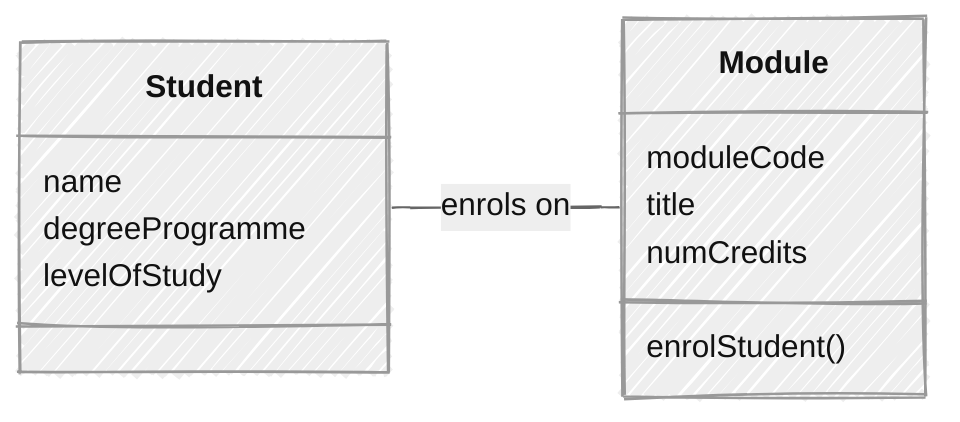
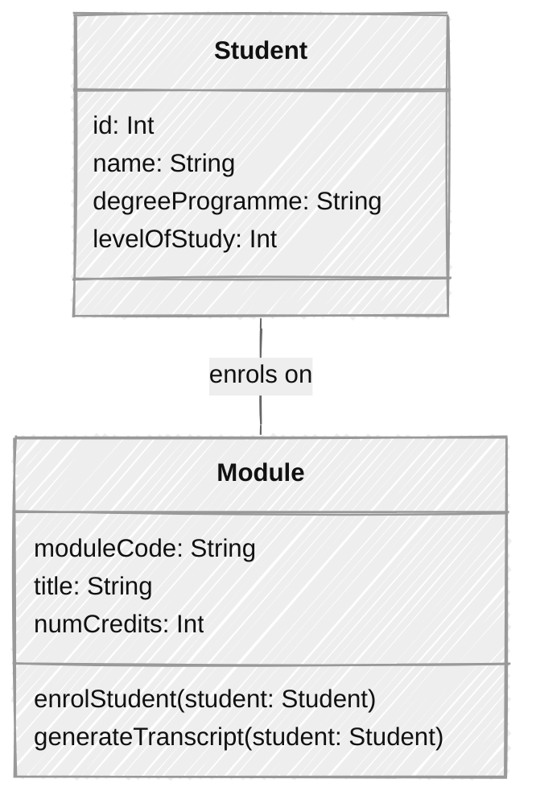

# UML Class Diagrams

## What Is UML?

UML, [**Unified Modelling Language**][uml], is an international standard for
visual modelling of software systems. It includes specifications for [thirteen
different diagrams][diags] that support all stages of the software development
process.

One of the most important and widely used of the UML diagrams is the
[**class diagram**][cls].

:::{note}
Like any international standard that tries to meet the varied needs of many
different stakeholders, UML is very large and extremely complex. Most software
developers use only a small subset of its features, and they often use these
features in a relatively informal way.

We will follow this more limited and informal approach in COMP2850.

A good resource for learning more about using UML in a relatively lightweight
manner is Scott Ambler's [Agile Modeling website][am].
:::

## Simple Classes

The simplest possible representation of a class is a rectangle, containing
the class name. This simple representation is typically adopted in the early
stages of analysis, when we are focused on which classes might be needed to
model a system, and how they might relate to each other.

The relationships between these classes are drawn as solid lines, labelled to
describe the nature of the relationship (@fig-simple-classes). This is the
syntax for **associations**. We consider associations and other types of class
relationship in more detail [later][org]. We will defer further discussion of
UML syntax for relationships until then.

````{figure}
:label: fig-simple-classes
:enumerator: 11.3.1
:alt: UML diagram showing classes as rectangles, linked by lines representing their relationships


A simple UML class diagram
````

## Adding Detail

Classes can include details of their attributes, their operations or both.
In this representation, we divide the rectangle into three compartments.
The class name occupies the top compartment, the attributes are listed in
the middle compartment, and the operations are listed in the bottom
compartment (@fig-detailed-classes).

In the example of @fig-detailed-classes, neither the attribute lists nor the
operations lists are complete. Also, we have not specified types for the
attributes, nor have we provided information on parameters and types for the
`enrolStudent()` operation.

**This is entirely normal.** The amount of detail shown for a class is a
choice made by the analyst, based on how much is currently known about the
class and what information the class diagram is intended to convey.

````{figure}
:label: fig-detailed-classes
:enumerator: 11.3.2
:alt: UML diagram showing classes as rectangles containing details of attributes and operations


A more detailed UML class diagram
````

## Design-Level Diagrams

Class diagrams differ in appearance, depending on whether they are drawn at
the analysis level or the design/implementation level.

A design-level class diagram contains more detailed information about classes.
On such a diagram, we would specify some or all of the following:

* Attribute types
* Attribute visibility (`+` for public, `-` for private)
* Type of value returned by an operation
* Parameters needed by an operation (names and types)
* Navigability of class relationships (see later)

This information provides further guidance to the programmer tasked with
implementing the classes on the diagram.

@fig-design-level is a design-level version of the analysis-level class
diagram in @fig-detailed-classes. It contains much of the information needed
to implement the classes in Kotlin.

````{figure}
:label: fig-design-level
:enumerator: 11.3.3
:alt: UML diagram showing classes as rectangles containing full implementation details of fields & methods


Example of a design-level class diagram
````

:::{note}
It often isn't necessary to draw class diagrams with this level of detail.

Teams following an agile software development approach will often move directly
from less detailed analysis-level class diagrams to implementations.
:::


[uml]: https://www.omg.org/uml/
[diags]: https://agilemodeling.com/essays/umldiagrams.htm
[cls]: https://agilemodeling.com/artifacts/classDiagram.htm
[am]: https://agilemodeling.com/
[org]: ../org-class/index.md
