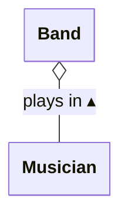
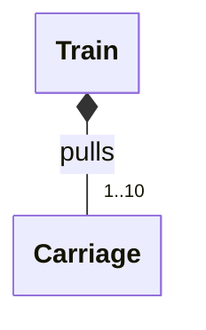

# Aggregation & Composition

In some associations between classes, the class on one side of the
relationship can be regarded as representing a **composite** of some kind,
whereas the class on the other represents one of the **component parts** that
make up that composite.

A relationship of this particular kind can be described as an **aggregation**
or a **composition**. Which of these two options applies is determined by
considering the lifetime of the parts and whether they can be shared by
different composites or not.

## Aggregation

Consider the relationship between a band and its musicians. The band is the
composite entity. The musicians are the component parts of the band.

This relationship is aggregation rather than composition because a band does
not necessarily have exclusive ownership of the musicians that are part of
it. It is possible for a musician to be a member of more than one band at the
same time[^mus]. Also, if a band decides to end its existence, the musicians
that were members of it do not automatically cease to be musicians.

### UML Representation

@fig-band-musician shows how we represent the fact that a band is an
aggregration of muscians using UML.

````{figure}
:label: fig-band-musician
:enumerator: 14.4.1


Aggregation relationship between a band and its members
````

Notice the arrowhead on the relationship label, telling us that it applies
upwards: i.e., a musician plays in a band; a band does not play in a musician!

The new feature here is the unfilled diamond, appearing on the composite end
of the relationship. **An unfilled diamond signifies aggregation.**

:::{tip}
People new to object-oriented software software development often overuse
aggregation or composition on UML diagrams.

Remember that both are special kinds of association, so it is always valid
to draw an aggregation as a plain association on a class diagram.

Add the diamond only when it is very clear that one class can be decribed
as a composite and the other as a part of that composite, and you want
to convey that fact to the reader.
:::

### Implementation in Kotlin

The aggregation relationship between `Band` and `Musician` described in
@fig-band-musician could be implemented in Kotlin like this:

```{code} kotlin
:linenos:
data class Musician(val name: String, val role: String)

class Band(val name: String) {
    private val members = mutableSetOf<Musician>()

    operator fun plusAssign(musician: Musician) {
      members.add(musician)
    }

    operator fun minusAssign(musician: Musician) {
      members.remove(musician)
    }
}
```

We use a set to keep track of the band members, rather than a list. This
makes it easy to ensure that a particular musician can't join a band more
than once.

The use of a set is a private implementation detail of the class, so clients
of `Band` can't interact with it directly; instead, musicians are made to
join or leave a band by using the public API provided by the overloaded `+=`
and `-=` operators:

```kotlin
val irons = Band("Iron Maiden")
...
// September 1981
irons -= Musician("Paul Di'Anno", role="vocals")
irons += Musician("Bruce Dickinson", role="vocals")
```

The important point to note here is that the `Musician` objects representing
band members are created externally. A `Band` object stores references to
those `Musician` objects, but it does not claim ownership of them, nor is
it responsible for managing their existence.

## Composition

Imagine a software system designed to simulate train travel. This might have
a class to represent a train and another to represent an individual carriage
of that train. Once again, we have a composite (the train) and component parts
(the carriages).

The relationship here is composition rather than aggregation. This is because
a `Train` object has 'strong ownership' of its carriages. A `Carriage`
object belongs to the `Train` object (for a period of time, at least), and
cannot be shared by multiple `Train` objects at the same time.

### UML Representation

@fig-train-carriage shows how we represent the fact that a train is composed
of carriages using UML.

````{figure}
:label: fig-train-carriage
:enumerator: 14.4.2


Composition relationship between a train and its carriages
````

We've added a multiplicity here to show that there are restrictions on the
number of carriages that can form part of a train (dictated by platform
length, engine power, etc).

The key feature of @fig-train-carriage is the use of a filled diamond at the
composite end of the relationship. **A filled diamond signifies composition.**

### Implementation in Kotlin

Let's consider how this composition relationship between `Train` and `Carriage`
could be implemented as code.

We will assume that a `Carriage` has two properties: a unique identifier and
the number of seats it has (both integers). We will also assume that a `Train`
has a property representing the number of carriages that it pulls, and that
this is constrained as indicated in the UML diagram above.

Given these assumptions, @fig-train-carriage could be implemented like this:

```{code} kotlin
:linenos:
const val MAX_SIZE = 10

class Carriage(val id: Int, val seats: Int)

class Train(val size: Int, seatsPerCarriage: Int) {

    private val carriages = mutableListOf<Carriage>()

    init {
        // Ensure that no. of carriages is valid
        require(size in 1..MAX_SIZE) { "Invalid train size" }

        // Create each carriage and add it to train
        for (id in 1..size) {
            carriages.add(Carriage(id, seatsPerCarriage))
        }
    }

    // Computed property for total number of seats on this train
    val seats: Int get() = carriages.sumOf { it.seats }
    ...
}
```

As in the example of a band and its musicians, we use one of Kotlin's
collection types as the basis for the implementation of the relationship
(a mutable list, in this case&mdash;see line 7).

Once again, we make that collection private, so that users of `Train`
can't interact with it except in ways that we specify, via methods or
computed properties of the class.

But there is a very important difference between this code and the code
from the band & musicians example, relating to object ownership and lifetime.

Here, `Carriage` objects are managed by a `Train` object. It creates those
objects via an initalizer block (lines 9&ndash;17). Clients of `Train` do not
have direct access to those objects, so they cannot be shared. When a `Train`
object is destroyed and the memory it uses is reclaimed, the `Carriage`
objects will also be destroyed, and the memory allocated to them will be
reclaimed.

In the band & musicians example, destroying a `Band` object and reclaiming
the allocated memory won't necessarily lead to destruction and memory
reclamation for `Musician` objects, because other code may continue to hold
references to those objects.


[^mus]: This is more common than you might think, given how difficult it is
to make a living as a musician these days.
