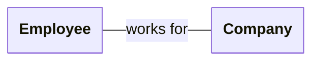
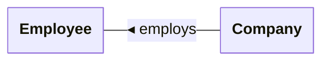
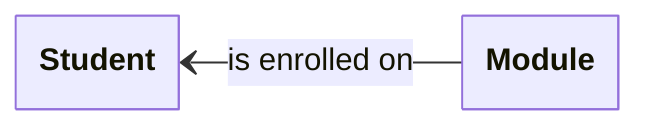
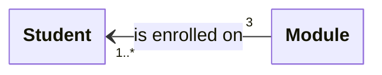
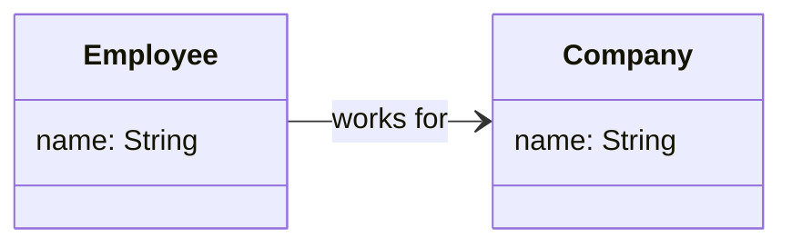
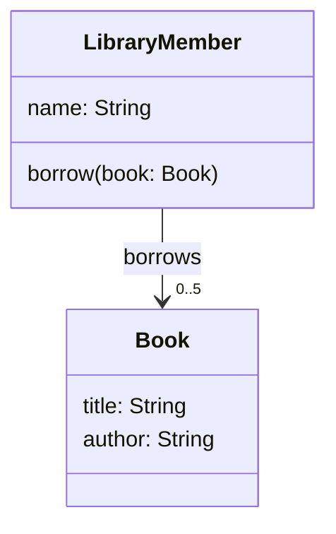

# Association

We say that one class **associates** with another if it knows about, and
regularly collaborates with, that other class in order to perform its tasks.

Unlike a simple dependency, which typically indicates a transient collaboration
between classes, the collaboration represented by an association isn't
temporary.

This means that an instance of one class must be linked to an instance of the
other class, so that it can invoke methods of that instance whenever it needs
to do so.

## Representation in UML

Associations are shown on UML class diagrams by drawing a **solid line**
between two classes. Ideally, that line should also be labelled to indicate
the nature of the association.

Association labels are read from left to right or top to bottom by default
([Figure 14.3.1{subEnumerator}](#fig-assoc-l2r)). If you need the association to be
read in the opposite direction to those defaults, you should show this by
including a small triangular arrowhead beside the label
([Figure 14.3.1{subEnumerator}](#fig-assoc-r2l)).

````{figure}
:enumerator: 14.3.1
:label: fig-uml-assoc

(fig-assoc-l2r)=


(fig-assoc-r2l)=


UML syntax for associations
````

### Navigability

You can indicate that an association is navigable in a specific direction or
in both directions by including a **v-shaped arrowhead** on one or both ends
of the association.

For example, a module enrolment system might have classes named `Student`
and `Module`, associated as shown in @fig-assoc-nav.

````{figure}
:label: fig-assoc-nav
:enumerator: 14.3.2


Association with explicit navigability
````

This relationship is navigable in one direction only: from `Module` to
`Student`. In other words, a `Module` object knows about a `Student` who
enrols on a that module, but a `Student` object doesn't keep track of
the modules with which it has been linked.

:::{caution}
Don't get confused between the directionality applied to an association
label and the navigability of the association itself. These are different
things!

In the example above, the directionality of the association label is
left-to-right, from `Student` to `Module`: we read the association as
"a student is enrolled on a module".

However, in an implementation of these classes, the relationship is navigable
in the **opposite direction**, from `Module` to `Student`, as indicated by
the v-shaped arrowhead.

Given a `Module` object, we can find the students enrolled on that module, but
if we have a `Student` object then we cannot immediately enumerate all of the
modules on which this student is enrolled.
:::

:::{note}
Navigability is an optional feature of UML class diagrams.

It's quite common not to show it all when doing object-oriented modelling of
a system, making the final decisions about navigability when the classes
are actually implemented.
:::

### Multiplicity

You can add **multiplicity** to either end of an association to indicate
how many objects are expected to participate in the relationship.

Here are some examples of the syntax:

| Multiplicity | Meaning
|--------------|-----------------------
| `1`          | Exactly one object
| `*`          | Any number of objects
| `0..1`       | Zero or one object
| `1..6`       | Between 1 and 6 objects
| `1..*`       | At least one object, no upper limit

@fig-assoc-mult takes the `Student` & `Module` example from @fig-assoc-nav and
adds multiplicities to model the relationship that applies to Level 2 of your
Computer Science degree.

````{figure}
:label: fig-assoc-mult
:enumerator: 14.3.3


Association with explicit multiplicities
````

The 'English translation' of @fig-assoc-mult is as follows:

> A Module can have one or more students enrolled on it, and there is no
> upper limit on enrolment. Each Student is enrolled on precisely 3 modules.
> Given a Module, we can easily enumerate all of the students enrolled on it.
> Given a Student, we cannot identify directly the modules on which they
> are enrolled.

:::{note}
Multiplicity, like navigability, is an optional feature of UML class diagrams.

Add multiplicities only if it is clear what they should be and it feels useful
to do so.
:::

## Representation in Kotlin

### Basic Example

Let's return to the example of `Employee` and `Company` seen earlier.
We will assume that both employees and companies have names. @fig-employ
shows this information along with the relationship between the two classes.

````{figure}
:label: fig-employ
:enumerator: 14.3.4


Relationship between an employee and the company they work for
````

We assume here that the relationship is navigable in one direction only,
from `Employee` to `Company`. This isn't necessarily realistic, but it keeps
the example simple.

@fig-employ can be implemented in Kotlin like so:

```kotlin
class Company(val name: String)

class Employee(val name: String, val employer: Company)
```

The `employer` property is initialized when we create an `Employee` object,
establishing a permanent connection with a `Company` object, as required
by the association.

:::{danger} Important
Notice that `employer` is not shown explicitly as a property of `Employee` on
the UML diagram.

**The existence of a property of type `Company` is already implied by the
association.** It would be a mistake to also list the property in the
properties section of `Employee`.
:::

### More Complex Example

Imagine a lending library for books. The software managing this library
records the names of library members, and the title & author of each book
owned by the library. Members are allowed to borrow up to 5 books at a time.

This description suggests a need for classes `LibraryMember` and `Book`,
associated as shown in @fig-library.

````{figure}
:label: fig-library
:enumerator: 14.3.5


Relationship between a library member and the books they borrow
````

@fig-library suggests a Kotlin implementation like the following:

```kotlin
const val MAX_BOOKS = 5

data class Book(val title: String, val author: String)

class LibraryMember(val name: String) {
    private val borrowed = mutableListOf<Book>()

    fun borrow(book: Book) {
        check(borrowed.size < MAX_BOOKS) { "Borrow limit reached" }
        borrowed.add(book)
    }
    ...
}
```

`Book` is a simple data class doing nothing beyond storing details of a book's
title and author. It doesn't need to be any more complex than that, because
the association is not navigable from `Book` to `LibraryMember`: books don't
keep track of who has borrowed them.

All of the complexity is therefore in `LibraryMember`. The one-to-many
association is implemented via the property `borrowed`, which is a
`MutableList<Book>` object. This list keeps track of the books borrowed by
a member.

The association has a constraint: no more than 5 books can be borrowed at any
one time. To enforce this constraint, we make the list of books private and
provide a public `borrow()` method that users of the class must call in order
to borrow a book. This will add a book to the list only if the library member
hasn't already reached their limit of 5 books.
