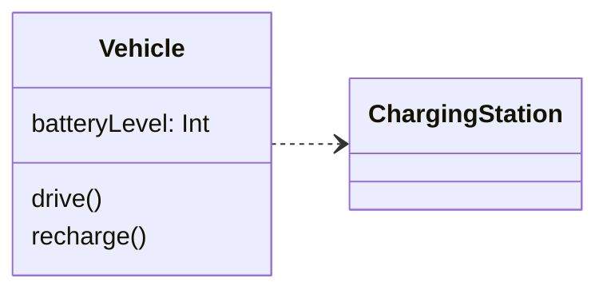

# Dependency

A **dependency** between two classes indicates that one class needs to make
use of the other, typically for a short period of time.

For example, suppose we have a transport simulation involving electric
vehicles. A vehicle will be able to drive for a period of time, until the
level of charge on its battery falls below some threshold, at which point it
will need to seek out a charging station in order to recharge the battery.

There are two obvious classes here: `Vehicle` and `ChargingStation`.
However, the relationship between them is transient in nature. A `Vehicle`
object won't need permanent access to a `ChargingStation` object. The
two objects will interact only during the recharging process.

In UML, we represent relationships of this kind using a **dashed line, with
a v-shaped arrowhead** (@fig-uml-dependency). The arrow must point from the
class that has the dependency, towards the class on which it depends.

````{figure}
:label: fig-uml-dependency
:enumerator: 14.2


Example of showing a simple dependency in UML
````

@fig-uml-dependency tells us that `Vehicle` depends on `ChargingStation`. The
implementation of the `recharge()` method will involve some interaction with
a `ChargingStation` object.

:::{note}
In practice, a class will often have dependencies on many other classes,
relying on them to help it perform its various duties.

**Generally, we do not show all these dependencies on a class diagram.**

Dependencies between classes should only be drawn if they are of particular
importance.
:::
