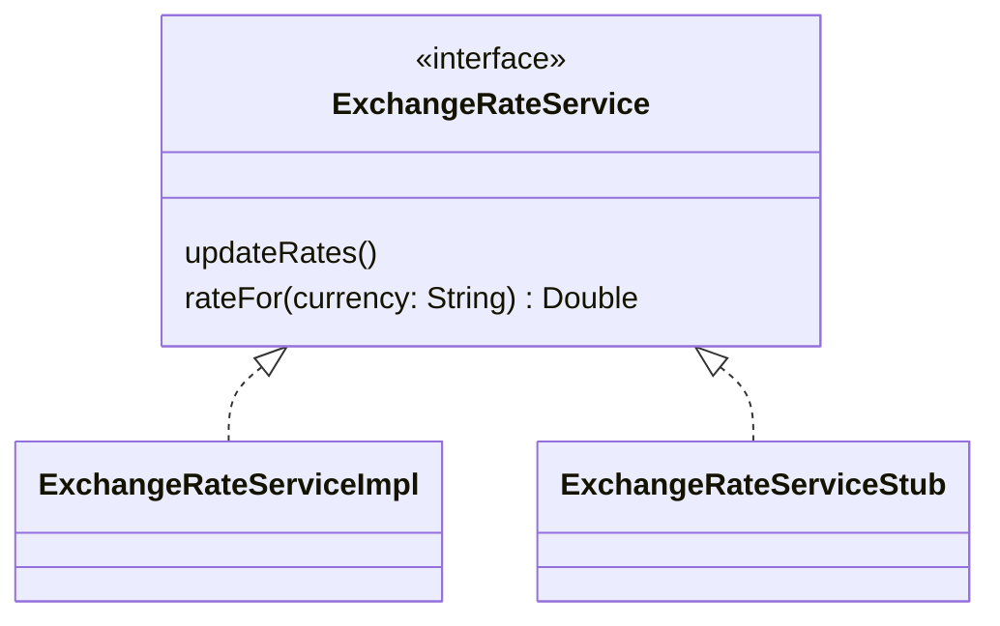

# Test Doubles

In object-oriented systems, it's normal for objects to do their work in
collaboration with other objects. When it comes to testing, this creates a
problem, because unit tests are supposed to test a small part of the system
**in isolation from other parts**.

The need for isolation becomes especially acute when the dependent code
interacts with something external to the system under test&mdash;a file, a
database, or a network resource, for example. We cannot write fast, reliable
and repeatable tests when there are external dependencies of this kind.

We can solve this problem by introducing a **test double**. A test double
is analogous to a 'stunt double' in a movie. A stunt double stands in for an
actor when they are required to do something physically challenging in a movie
scene. Similarly, a test double stands in for real code in a test: real code
that would have prevented that test from being fast, reliable or repeatable.

There are several different types of double:

* **Fakes** are objects with working implementations that employ shortcuts
  or simplifications so that they are better suited for use in tests. For
  example, if we had code dependent on a database accessed over the network,
  we could have our tests use a fake in-memory database in place of that
  real database.

* **Stubs** are simple objects that don't have working implementations.
  Instead, they provide pre-programmed responses to method calls made on the
  object.

* **Spies** are stubs that record some information about the methods that are
  invoked on them. For example, you might have an email sending service,
  with a `sendMail()` method. You could set up a spy that doubles for this
  service. It wouldn't actually send any emails, but it could count the
  number of times that `sendMail()` is called.

* **Mocks** encode detailed expectations about the methods that will be
  invoked on them. We would use a mock to verify that the code under test
  invokes those methods in the expected way. This is a deeper form of testing
  than the state verification approach that we typically use with stubs.

We will focus here on stubs.

## An Example

Suppose you are implementing a financial application that converts amounts
of money from British Pounds Sterling (GBP) to other currencies, such as US
Dollars (USD) or Japanese Yen (JPY).

You might have a `CurrencyConverter` class, instances of which perform such
conversions. Those instances might use an `ExchangeRateService` object to
provide the required exchange rates between GBP and other currencies:

```kotlin
val rateService = ExchangeRateService()
val converter = CurrencyConverter(rateService)
...
val amountInYen = converter.convertTo("JPY", amount)
```

Below is a working implementation of `ExchangeRateService`. It makes a network
call to a web API to obtain the current exchange rates between GBP and other
currencies. These rates are returned as [JSON data][json]. The implementation
uses the [Jackson][jck] library to parse the data, extracting exchange rates
and storing them in a map, with the three-letter currency codes used as keys.

```{code} kotlin
:linenos:
class ExchangeRateService {
    private val url = URI.create(SERVICE_URL).toURL()
    private val mapper = jacksonObjectMapper()
    private val rates = mutableMapOf<String, Double>()

    init { updateRates() }

    fun updateRates() {
        val json = mapper.readTree(url.openStream())   // network accessed here!

        for (rate in json.path("rates").properties()) {
            rates[rate.key] = rate.value.asDouble()
        }
    }

    fun rateFor(currency: String): Double = rates.getOrElse(currency) {
        throw IllegalArgumentException("Unsupported currency: $currency")
    }
}
```

When writing unit tests for `CurrencyConverter`, we shouldn't use this
implementation of `ExchangeRateService`, for several reasons:

* Bugs in the implementation of `ExchangeRateService` might affect our tests
* Creation of an `ExchangeRateService` object involves a network call on
  line 9, which will slow down the tests (even if we limit this by doing it
  only once, in a test fixture)
* Creation of an `ExhangeRateService` object could fail, e.g., if the API
  server is down
* Exchange rates change, but to make assertions about whether `convertTo()`
  returns the correct values, we need rates to be fixed

We clearly need to create a stub for `ExchangeRateService`, but how can we
do this?

## Using a Library

The simplest approach to creating a stub is to use a dedicated **object
mocking library**. One such library is [MockK][mk], which is designed
specifically for Kotlin.

Using MockK to create a stub is fairly easy. You must first associate your
stub object with the class that it is doubling for. Then you must declare what
the result of invoking methods on that stub should be.

### Task 13.5

The `tasks/task13_5` directory of your repository is a KT project containing
the classes described above. Take some time to examine the source code of
these classes.

The project contains a small program that performs currency conversion using
the full implementation of `ExchangeRateService`. Try running this program
with

    ./kotlin run

Now examine `module.yaml` to see how it specifies dependencies:

```yaml
dependencies:
  - $libs.jackson

test-dependencies:
  - $libs.kotest.assertions
  - $libs.kotest.framework
  - $libs.kotest.runner: runtime-only
  - $libs.mockk
```

Notice the distinction between the dependencies needed by the application
(the Jackson library) and the dependencies needed to run the tests. The latter
include components of Kotest that should now be familiar to you, plus a
new dependency on MockK.

As usual, the library catalog provides the Maven coordinates for all of these
dependencies.

Next, locate `CurrencyConverterTest.kt`. In this file, create the following
test fixture:

```kotlin
val service = mockk<ExchangeRateService>()

every { service.updateRates() } just Runs
every { service.rateFor("GBP") } returns 1.0
every { service.rateFor("USD") } returns 1.5
every { service.rateFor("JPY") } returns 190.0

val conv = CurrencyConverter(service)
```

Here, the `service` variable is our stub object. We use `every` to specify
how the stub should behave. The first use of `every` declares that calling
`updateRates()` is allowed, and that it does nothing. The other three uses of
`every` pre-program the stub to return specific values when `rateFor()` is
called for currency codes of `GBP`, `USD` and `JPY`.

The final line of the code above simply plugs this stub object into the
`CurrencyConverter` object that will be the subject of our tests.

:::{note}
`mockk`, `every`, `just` and `Runs` are all defined in the `io.mockk`
package. You'll need to add suitable import statements for them, if your
development environment does not do this automatically.
:::

Add a test like this:

```kotlin
"Amount can be converted to JPY" {
   conv.convertTo("JPY", 2.0) shouldBe (380.0 plusOrMinus 0.00001)
}
```

Add similar tests for the other two currencies that the stub knows about.
Then run the tests with

    ./kotlin test

The tests should all pass.

And that's all there is to it! You have now successfully isolated
`CurrencyConverter` from its dependency, using a stub.

## Creating Stubs Manually

:::{caution}
This explanation depends on concepts yet to be covered. You might want to
return to this section after having learned about [interfaces][int].
:::

Let's imagine that you don't have access to a mocking library. How could
you create your own stub, and have the ability to plug this in to a
`CurrencyConverter` object?

The trick is to make `ExchangeRateService` an **interface**, with
`updateRates()` and `rateFor()` methods. We then make the real working version
of the service implement this interface. Finally, we write a stub that also
implements the interface. @fig-manual-stub shows what this approach looks
like in UML.

````{figure}
:label: fig-manual-stub
:enumerator: 13.5


Example of the manual approach to stubbing a dependency
````

In Kotlin, the `ExchangeRateService` interface will look like this:

```kotlin
interface ExchangeRateService {
    fun rateFor()
    fun updateRates()
}
```

`ExchangeRateServiceStub` will look like this:

```kotlin
class ExchangeRateServiceStub : ExchangeRateService {
    fun updateRates() {
        // does nothing!
    }

    fun rateFor(currency: String) = when(currency) {
        "GBP" -> 1.0
        "USD" -> 1.5
        "JPY" -> 190.0
        else  -> throw IllegalArgumentException("$currency")
    }
}
```

`ExchangeRateServiceImpl` will be defined in a similar way, except that the
`updateRates()` and `rateFor()` methods will contain the real implementations
shown earlier.

Now, our unit tests can use the stub when creating a fixture:

```kotlin
val service = ExchangeRateServiceStub()
val conv = CurrencyConverter(service)
```

Applications that use `CurrencyConverter` will obviously need to use the full
implementation of the service, rather than the stub:

```kotlin
val service = ExchangeRateServiceImpl()
val conv = CurrencyConverter(service)
...
val amountInYen = currency.convertTo("JPY", amount)
```

:::{note}
Clearly, this approach involves more code than using a mocking library.

However, there are other benefits to hiding the service implementation behind
an interface. For one thing, it allows us to have multiple working
implementations of the service, e.g., one that uses a web API, another that
retrieves exchange rates from a database, etc.

Because `CurrencyConverter` is defined in terms of the interface rather than
any specific implementation of it, we are free to 'plug in' any valid
implementation of the service when we create a `CurrencyConverter` object.
:::

[json]: https://en.wikipedia.org/wiki/JSON
[jck]: https://github.com/FasterXML/jackson
[mk]: https://mockk.io/
[int]: ../interfaces/index.md
